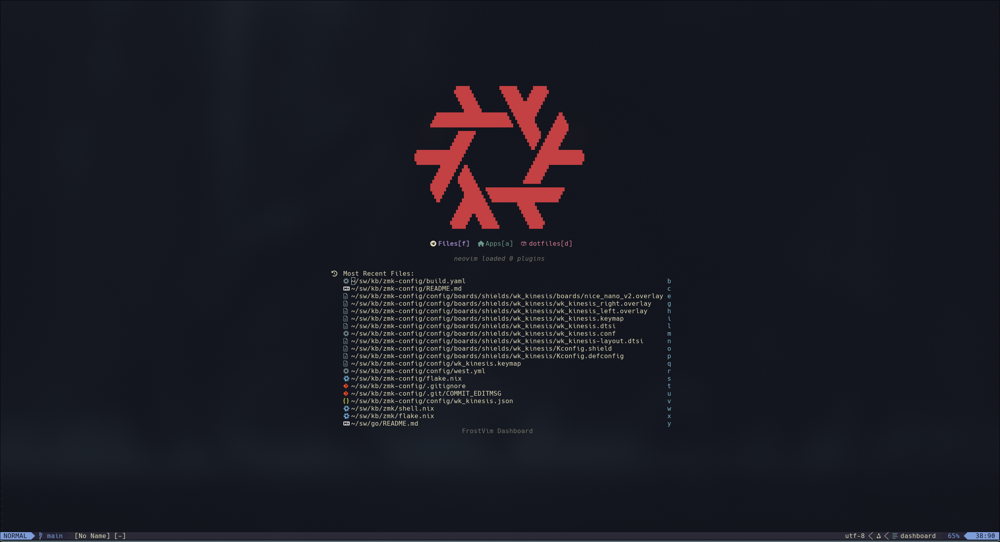

# Frostvim

A Nix flake providing a customized Neovim configuration built with [Nixvim](https://github.com/nix-community/nixvim).



## Flake outputs

| Output | Description |
|--------|-------------|
| `packages.<system>.default` | The fully configured Neovim binary |
| `nixvimModules.default` | The complete frostvim nixvim module — import this to get everything |
| `nixvimModules.<plugin>` | Individual plugin modules — import only what you need |

Every directory under `config/plugins/` and `config/colorschemes/` is automatically exposed as its own `nixvimModules.<name>` entry. Current modules:

`blink` · `clipboard-image` · `cmp` · `code_companion` · `dashboard` · `git` · `go` · `images` · `kanagawa` · `lint` · `lsp` · `lualine` · `luasnip` · `lzn` · `markdown-preview` · `mini` · `noice` · `oil` · `opencode` · `presence` · `quicker` · `snacks` · `telekasten` · `tree-sitter` · `trouble` · `web-devicons` · `which-key`

---

## Quick start

Run Neovim directly without installing:

```bash
nix run github:FKouhai/frostvim/main
```

---

## Using frostvim downstream

### Home Manager (recommended)

Add frostvim as a flake input and import the nixvim module inside `programs.nixvim`:

```nix
# flake.nix
inputs = {
  nixpkgs.url = "github:nixos/nixpkgs/nixos-unstable";
  nixvim.url = "github:nix-community/nixvim";
  frostvim.url = "github:FKouhai/frostvim/main";
};
```

```nix
# home.nix (or any home-manager module)
{ inputs, ... }:
{
  imports = [ inputs.nixvim.homeModules.nixvim ];

  programs.nixvim = {
    enable = true;
    _module.args.inputs = inputs;

    imports = [ inputs.frostvim.nixvimModules.default ];

    # Add your own plugins on top
    plugins.flash.enable = true;
  };
}
```

### NixOS system packages

```nix
# configuration.nix
{ inputs, pkgs, ... }:
{
  environment.systemPackages = [
    inputs.frostvim.packages.${pkgs.system}.default
  ];
}
```

### Standalone nixvim configuration

```nix
# flake.nix
{
  inputs = {
    nixpkgs.url = "github:nixos/nixpkgs/nixos-unstable";
    nixvim.url = "github:nix-community/nixvim";
    frostvim.url = "github:FKouhai/frostvim/main";
  };

  outputs = { nixpkgs, nixvim, frostvim, ... }:
    let system = "x86_64-linux";
    in {
      packages.${system}.default =
        nixvim.legacyPackages.${system}.makeNixvimWithModule {
          pkgs = nixpkgs.legacyPackages.${system};
          module = {
            imports = [ frostvim.nixvimModules.default ];
            # your overrides here
          };
        };
    };
}
```

---

## Cherry-picking individual modules

Instead of importing the full `nixvimModules.default`, you can compose only the
modules you want. Each module is self-contained: it defines its own enable option
(defaulting to `true` where appropriate) and its own configuration.

```nix
programs.nixvim = {
  enable = true;
  imports = [
    inputs.frostvim.nixvimModules.lsp
    inputs.frostvim.nixvimModules.lualine
    inputs.frostvim.nixvimModules.snacks
    inputs.frostvim.nixvimModules.kanagawa
  ];
};
```

---

## Completion engine: cmp vs blink

Frostvim ships two completion engines. They are **mutually exclusive** — enabling
one automatically disables the other.

| Module | Default | Engine |
|--------|---------|--------|
| `cmp` | **enabled** | nvim-cmp — mature, wide ecosystem |
| `blink` | disabled | blink.cmp — fast, native, neovim 0.10+ |

### Switching to blink

```nix
programs.nixvim = {
  enable = true;
  imports = [ inputs.frostvim.nixvimModules.default ];

  # Enabling blink automatically disables cmp
  blink.enable = true;
};
```

blink comes pre-configured with:
- `blink-compat` (nvim-cmp source compatibility, useful for plugins like `codecompanion`)
- `blink-pairs` (auto-pairs with rainbow bracket highlights)
- `blink-indent` (rainbow indent guides)
- `blink-cmp-spell` (vim spellcheck as a completion source)
- `blink-cmp-words` (dictionary word completion)
- neovim's built-in snippet engine (`vim.snippet`)

### Keeping cmp, disabling blink

cmp is on by default. Nothing extra is needed. To be explicit:

```nix
{ cmp.enable = true; }
```

### Disabling both

If you want to bring your own completion setup entirely:

```nix
{
  cmp.enable = false;
  blink.enable = false;
}
```

---

## Overriding plugin defaults

Every frostvim module exposes its own enable option (`lib.mkDefault`), so you
can turn individual plugins on or off without touching the rest:

```nix
programs.nixvim = {
  enable = true;
  imports = [ inputs.frostvim.nixvimModules.default ];

  # Disable plugins you don't want
  dashboard.enable = false;
  telekasten.enable = false;
  presence.enable = false;

  # Enable something that ships disabled by default
  blink.enable = true;
};
```

---

## Extending keymaps

Frostvim keymaps are defined as a regular nixvim `keymaps` list. Appending your
own keymaps alongside the defaults is straightforward:

```nix
programs.nixvim = {
  enable = true;
  imports = [ inputs.frostvim.nixvimModules.default ];

  keymaps = [
    {
      mode = "n";
      key = "<leader>h";
      action = ":echo 'hello'<CR>";
      options = { silent = true; desc = "Say hello"; };
    }
  ];
};
```

---

## Development

```bash
# Build
nix build

# Run checks (includes pre-commit: statix + nixfmt)
nix flake check

# Dev shell with pre-commit hooks wired up
nix develop
```

### Adding a new plugin

1. Create `config/plugins/<name>/default.nix` following the existing pattern
2. That's it — `importDirs` in `config/default.nix` and `autoModules` in `flake.nix` pick it up automatically

```nix
# config/plugins/myplugin/default.nix
{ lib, config, ... }:
{
  options.myplugin.enable = lib.mkEnableOption "Enable myplugin";

  config = lib.mkMerge [
    { myplugin.enable = lib.mkDefault true; }
    (lib.mkIf config.myplugin.enable {
      plugins.myplugin.enable = true;
    })
  ];
}
```
